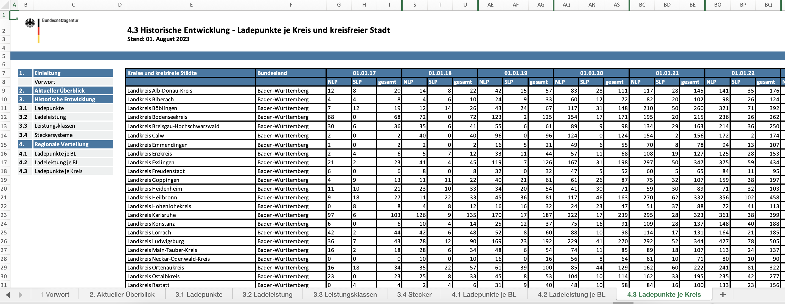

# Assessment of the Chosen Data Sources

Tasks
 - Verify the license
 - Evaluate the source of the data
 - Preview the Data
 
Deliverables
 - short description of each data source including licensing and data publisher

## Overview

| Datasource | 1                                                                                                                                                                               | 2                                                                                                                                                                                                                                                                                                                                         | 3                                                                                                                                                                                                                                                                                                                                          |
|------------|---------------------------------------------------------------------------------------------------------------------------------------------------------------------------------|-------------------------------------------------------------------------------------------------------------------------------------------------------------------------------------------------------------------------------------------------------------------------------------------------------------------------------------------|--------------------------------------------------------------------------------------------------------------------------------------------------------------------------------------------------------------------------------------------------------------------------------------------------------------------------------------------|
| Title      | Connectivity between largest German Cities                                                                                                                                      | List of Electric Vehicle (EV) Charging Points in Germany                                                                                                                                                                                                                                                                                  | EV Charging Point Infrastructure in Germany                                                                                                                                                                                                                                                                                                |
| URLs       | [Metadata](https://mobilithek.info/offers/573356838940979200), [Data](https://mobilithek.info/mdp-api/files/aux/573356838940979200/moin-2022-05-02.1-20220502.131229-1.ttl.bz2) | [Metadata](https://www.bundesnetzagentur.de/DE/Sachgebiete/ElektrizitaetundGas/Unternehmen_Institutionen/E-Mobilitaet/Ladesaeulenkarte/start.html) ,  [Data](https://www.bundesnetzagentur.de/SharedDocs/Downloads/DE/Sachgebiete/Energie/Unternehmen_Institutionen/E_Mobilitaet/Ladesaeulenregister_CSV.csv?__blob=publicationFile&v=54) | [Metadata](https://www.bundesnetzagentur.de/DE/Sachgebiete/ElektrizitaetundGas/Unternehmen_Institutionen/E-Mobilitaet/Ladesaeulenkarte/start.html),  [Data](https://www.bundesnetzagentur.de/SharedDocs/Downloads/DE/Sachgebiete/Energie/Unternehmen_Institutionen/E_Mobilitaet/Ladesaeuleninfrastruktur.xlsx?__blob=publicationFile&v=28) |
| Format     | .ttl.bz2                                                                                                                                                                        | .csv                                                                                                                                                                                                                                                                                                                                      | .xlsx                                                                                                                                                                                                                                                                                                                                      |
| Source     | Mobilithek.info                                                                                                                                                                 | Bundesnetzagentur.de                                                                                                                                                                                                                                                                                                                      | Bundesnetzagentur.de                                                                                                                                                                                                                                                                                                                       |
| License    | CC BY 4.0                                                                                                                                                                       | CC BY 4.0                                                                                                                                                                                                                                                                                                                                 | CC BY 4.0                                                                                                                                                                                                                                                                                                                                  |
| Owner      | CISS TDI GmbH                                                                                                                                                                   | Bundesnetzagentur.de                                                                                                                                                                                                                                                                                                                      | Bundesnetzagentur.de                                                                                                                                                                                                                                                                                                                       |

## Data Publishers and Owners

### Mobilithek (Publisher)
`With the Mobilithek, the Federal Ministry for Digital and Transport (BMDV) provides a platform that offers access to open mobility data and enables the B2B exchange of data offers. A central point of access to all data that gets you moving.`

Source: https://mobilithek.info/ (English Version)

### CISS TDI GmbH (Owner)
`Die CISS TDI GmbH ist ein mittelständisches Geoinformationsunternehmen, das seit 1982 Unternehmen und den öffentlichen Dienst mit Geodaten versorgt. Diese werden mit eigenen Werkzeugen veredelt und über Plattformen bereitgestellt. Aufgrund der Bedeutung von Geodaten in der heutigen digitalisierten Gesellschaft, leistet das Unternehmen durch den einfachen Zugang zu qualitativ hochwertigen Geoinformationen einen wichtigen Beitrag. Das Unternehmen beschäftigt etwa 40 Mitarbeiter und bietet kurze Entscheidungswege sowie Entfaltungsmöglichkeiten für kreative Köpfe.`

Source: https://www.ciss.de/ueber-uns/
Description of Project: https://bmdv.bund.de/SharedDocs/DE/Artikel/DG/mfund-projekte/moin.html

### Bundesnetzagentur (Owner, Publisher)
`We are Germany's main authority for infrastructure, promoting competition in the markets for energy, telecommunications, post and railways to guarantee the efficiency of our country's vital networks. As a consumer protection authority, we also safeguard the interests of the people using these networks.`

Source: https://www.bundesnetzagentur.de/EN/General/Bundesnetzagentur/AboutUs/start.html

### Conclusion
All three data sets were either created by a government contractor during a federal-funded research project (data source 1) or directly published by a government authority (data sources 2+3). This allows to rate the data as highly-trustworthy and reliable.

## Licensing

All datasets are licensed under CC BY 4.0.

This allows us to:
1. Share
2. Adapt

Under the terms:
1. Givving approproate credit.
2. Indicating if changes were made.
3. No application of legal terms or technological measures which restrict others from doing anything the license permits.

Source: https://creativecommons.org/licenses/by/4.0/deed.en

## A First Look at the Data

### Dataset 1
This dataset is a RDF*-graph. It contains entries about connections between cities, and describes these trips between cities regarding travel time, travel mode, distance, ...

Potential struggles:
- Transforming the graph into an easy-accessible format
- Decoding IRIs from the graph into human-readable information

### Dataset 2
This dataset is a csv-file. It contains all registered EV charging stations incl. location and details about the charging points.

Potential struggles:
- csv file contains additional non-csv data in the beginning
- Data needs ISO-Latin encoding because of the German 'Umlaute'

### Dataset 3
This dataset is an excel file. It contains the historic development of the number of charging points per city/district in Germany.

Potential struggles:
- the file contains several excel-sheets
- the sheets contain additional data on top
- the sheet contains merged cells

